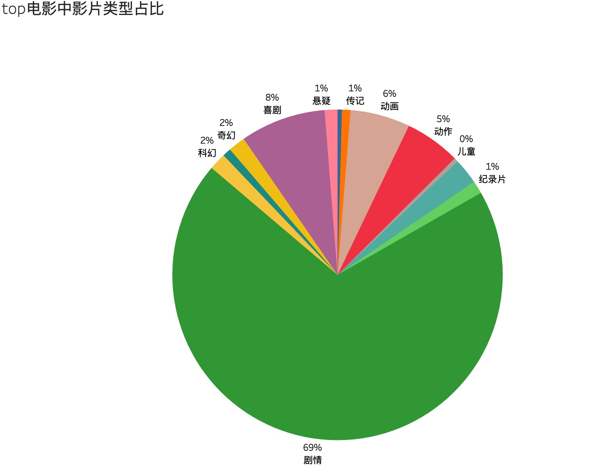
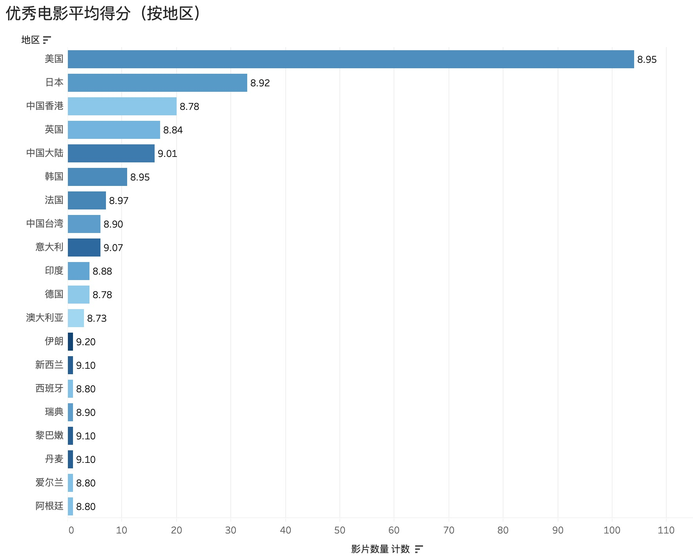

# 豆瓣top250电影分析
#### 介绍：通过爬虫技术获取豆瓣top250电影，同时进行相应的可视化操作，产出分析报告
#### 技术栈：sql、python，其中第三方库包括：urllib(获取豆瓣相关网站url)、beautifulsoup(从网站抓取数据)、re(正则)、numpy、pandas、matplotlib、pymysql(操作数据库)等，项目框架如下
- 通过获取豆瓣top电影的url，观察影片信息的相关html规则，进行爬虫
- 将爬下来的数据存储进数据库以及excel中，进行后续分析
- 将整理好的数据放入tableau进行构造相应的图标并进行详细分析，产出“豆瓣top250电影分析报告”

### 分析报告

##### 1.影片类型

剧情类电影在top250的电影中占比接近七成。原因之一是本项目的爬取的电影类型只选择第一个，即主要类型。如《泰坦尼克号》，其类型属于“剧情 爱情 灾难”，本项目只判断其为剧情；另一个重要的原因是无论是喜剧，爱情，灾难类型的电影，想要吸引观众，最关键的一点还是需要有足够动人的剧情，这意味着“剧情”是大多数优秀电影的核心。此外，喜剧电影也较易受到大众欢迎。

#### 2.演员
由于是豆瓣是中文网站，所以华语优秀影星在出现top电影中的出现频率较高，如周星驰(对喜剧电影的贡献非常突出)，张国荣(综合实力较为强劲)，梁朝伟等人都取得了不错的成绩；从全球范围来看，汤姆·汉克斯(综合实力强劲)、马特达蒙(动作电影较多)和小李子的表现最为耀眼；亚洲地区除了华语区影星，来自韩国的宋康昊的表现也非常突出；丹尼尔则比较特殊，凭借哈利波特系列(奇幻类电影)三次入选

#### 3.导演
入围top电影最多的导演是宫崎骏(几乎都以动画作品入围)；斯皮尔伯格和诺兰也分别入选了6部作品，相较而言，前者的指导作品的类型更加丰富；王家卫、李安则在某种意义上代表了华语导演的最高成就；硬汉姜文导演的作品也有三部入选top 250优秀电影，对于一个作品只有六部的导演来说还是非常难得的

#### 4.电影扎堆的年代
在上世纪90年代之前，由于电影基数不大，所以入选top的电影数也较少，一年能有两三部优秀电影已经算比较难得；90年代之后，电影业进入了高速发展的阶段，常常有许多优秀电影扎堆出现，并且这种扎堆表现出了一定的波动性，如1994年、2003年以及2010年仅一年就产出了10部以上的top250电影，而1996年、1998的表现则非常惨淡。

其中最值得一提的是被称为“上帝想看电影的一年”——1994年。这一年不仅优秀电影众多，而且表现为多个地区共同开花，这一年的优秀电影包括美国地区的《阿甘正传》，《肖申克的救赎》，欧洲的《这个杀手不太冷》，华语地区的《活着》，《阳光灿烂的日子》等等

###### 值得一提的是，尽管1994年一去不复返了，但是从年代的区间表现来看，最近二十年还是涌现出了不少优秀电影

#### 5.地区
美国在电影行业是毫无疑问的霸主，虽然有论点认为美国的爆米花电影居多，真正的艺术电影较少，但是通过分析豆瓣top250电影，发现这个论点并不成立，如下图所示：

###### 可以看到，美国不仅产出的优秀电影数量众多，并且这些电影的平均得分也较高，这在各个地区中(抛开伊朗、新西兰这些不具有参考价值的国家)属于中等偏上的水平；另一点符合预期的是，意大利作为一个人们印象中很文艺的国家，其推出的电影质量确实都很过硬(均分达到了9.07)；此外，中国香港虽然在top 250电影中的数量比大陆略高，但是整体质量比大陆稍逊一些

###### 上图以堆积图的形式更加直观的表现出了美国无论是在top250中的电影总数量还是9分以上的优秀电影数量都是碾压别的地区的存在

#### 6.评分人数与评分的关系
通过分析发现9.0分是在8.6-9.4区间内打分意愿最低的，这并不符合正态分布，不过这在一定程度上表明评分者认为9.0分以上和9.0分以下是有本质区别的，人们不愿意将一部电影模糊地归到9.0分，而是更愿意给它打8.9分(意味着这是一部较为优秀，同时有些许瑕疵的电影)，亦或是给其打9.1分(意味着这是一部很优秀的电影，值得9.0以上的评分)。具体分析如下:
- 一部平均分在8.5-9.0分之间的电影算是一部较为优秀的电影，但和9.0分以上的电影还是有本质差别，所以人们愿意给8.7-8.9分(尤其是8.8分的折中评价），这算是一种认可，同时也认为影片中还存在着少量不足
- 对于9.0分-9.5分区间内的优秀电影，评分者们更愿意给9.1分，并且对打更高的分整体持保守态度，这意味着评分者们认为这部电影是优秀电影，并且几乎没有瑕疵，但对其能否封神还持观望态度
- 对于9.5分以上的极优秀电影，人们愿意给9.5与9.7之间的9.6分，而相较于9.5分，人们也不吝给予自己心目中封神的电影9.7分的高分

